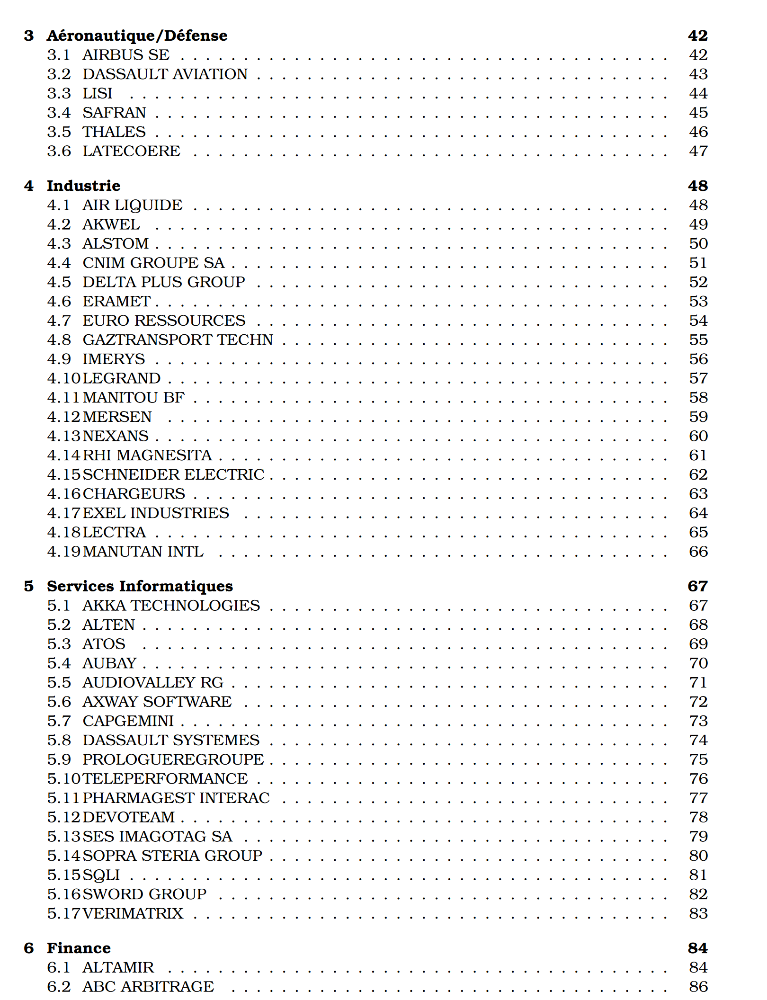
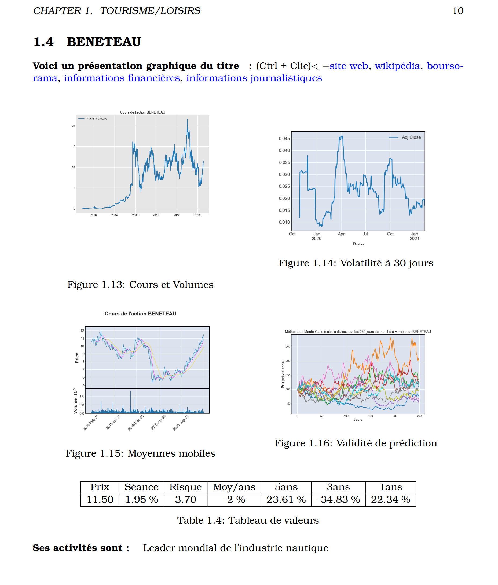
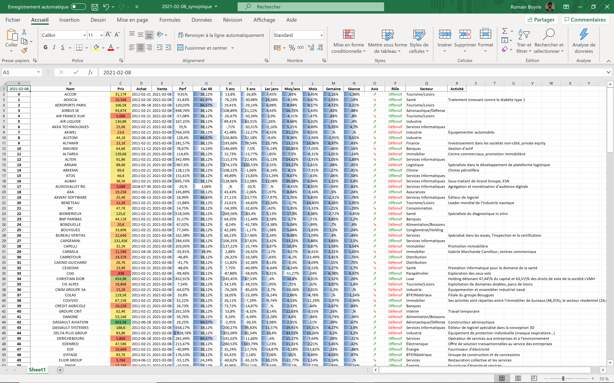

# Finance_Daily_Review
## Finance reporting

### Programme d’analyse financière avec création automatisée de rapports.
L’outil doit télécharger les données en ligne, puis les stocke dans une base de données locale où les titres sont regroupés, et/ou dans une série de fichier .xlsx individuellement pour chaque titre.
Pour créer un rapport .pdf, il est nécessaire d’installer les outils Tex/LaTex sur son système.

#### Voici deux exemples du report de sortie :

### Voici une capture d’écran du tableur de sortie :

### Version 0.01:

L’intelligence Artificielle du programme de prédiction est à améliorer.
